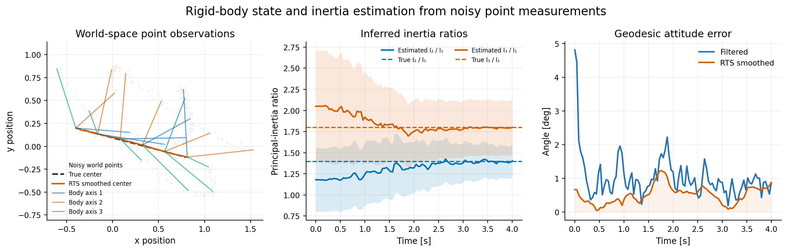
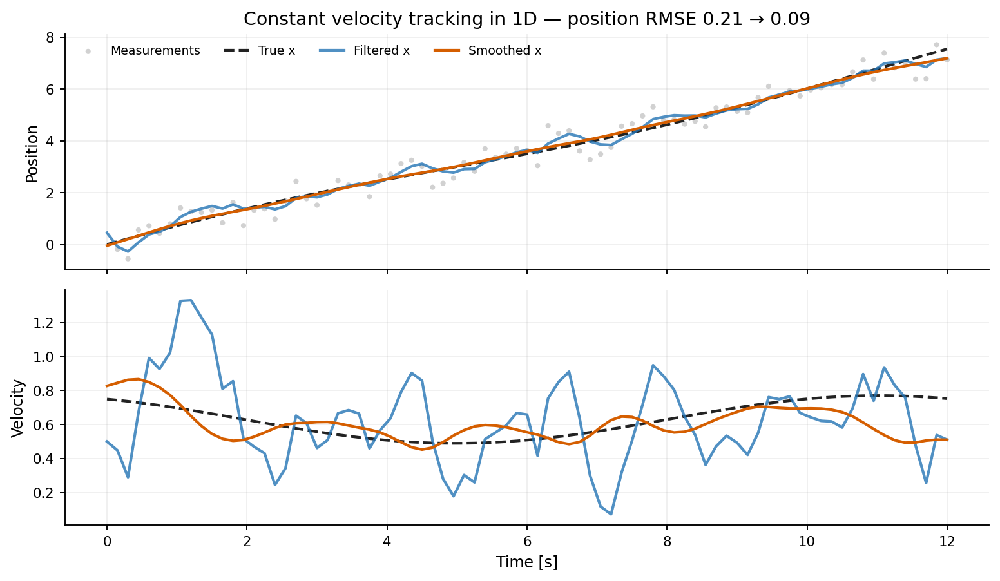
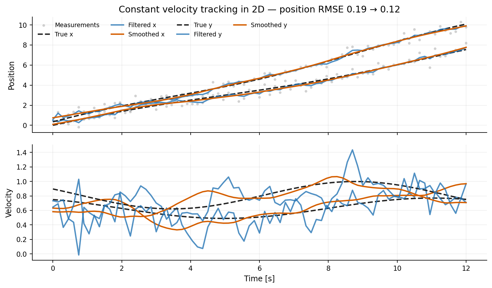
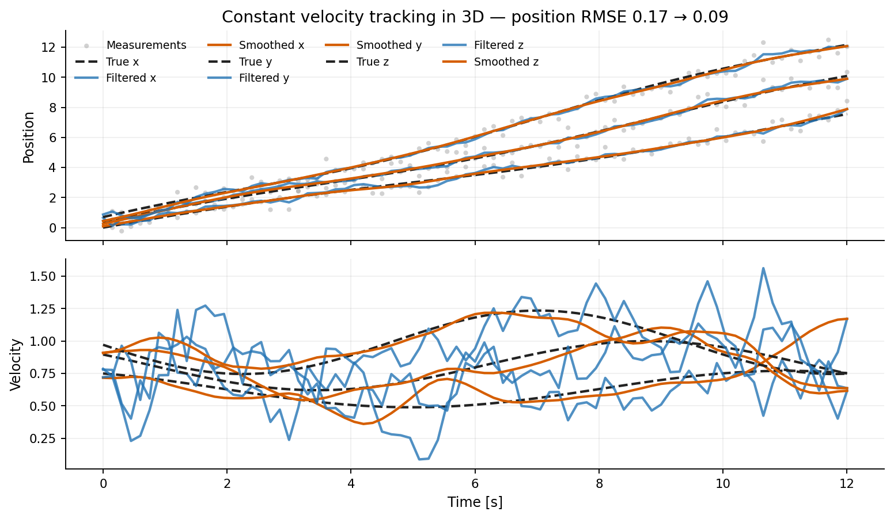
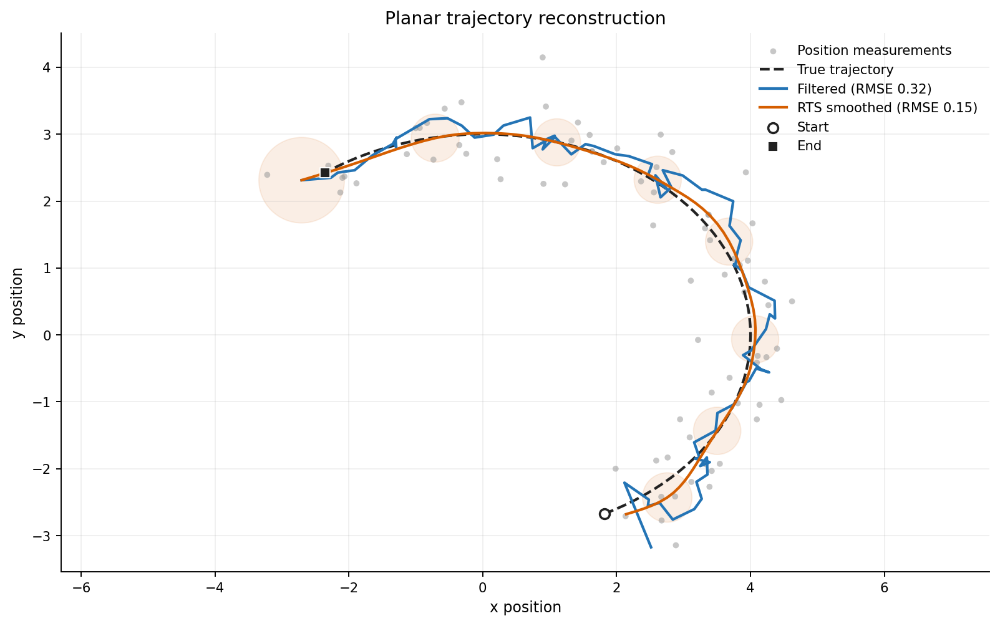
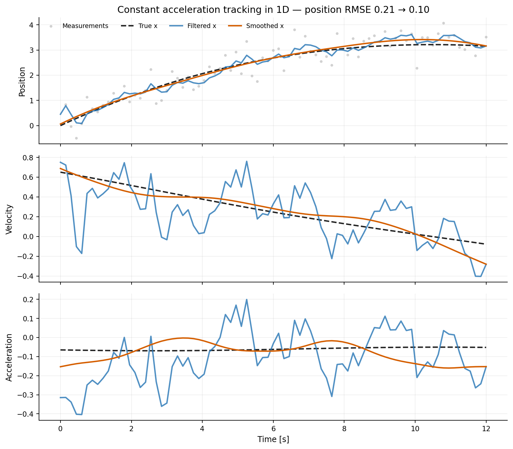
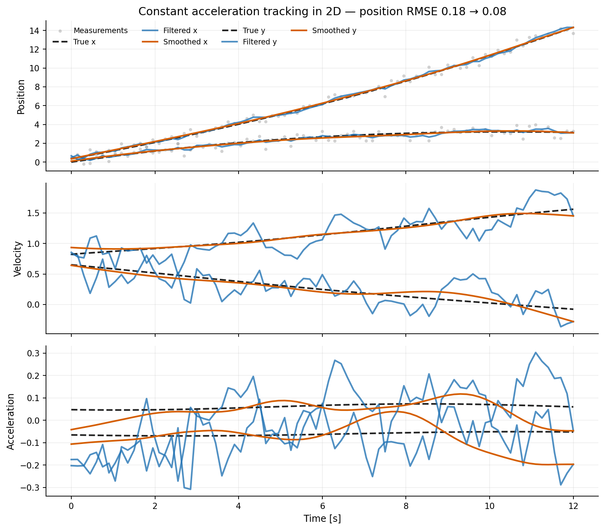
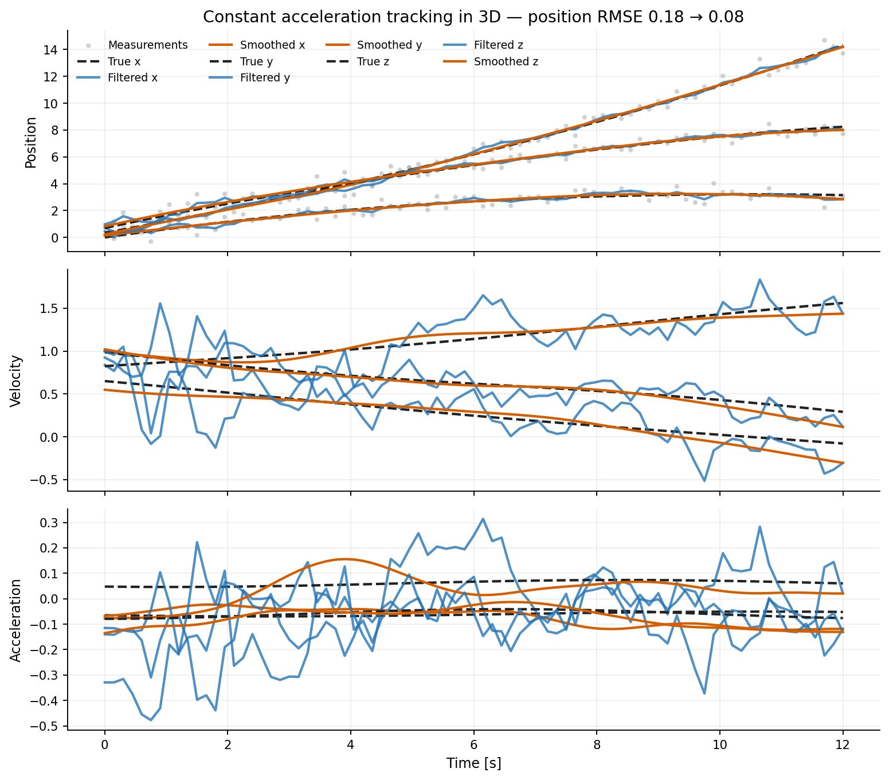
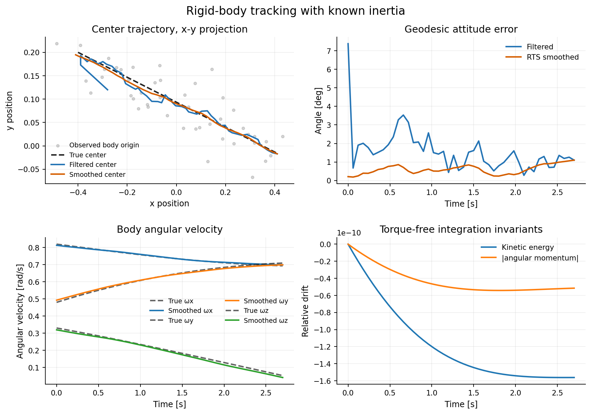
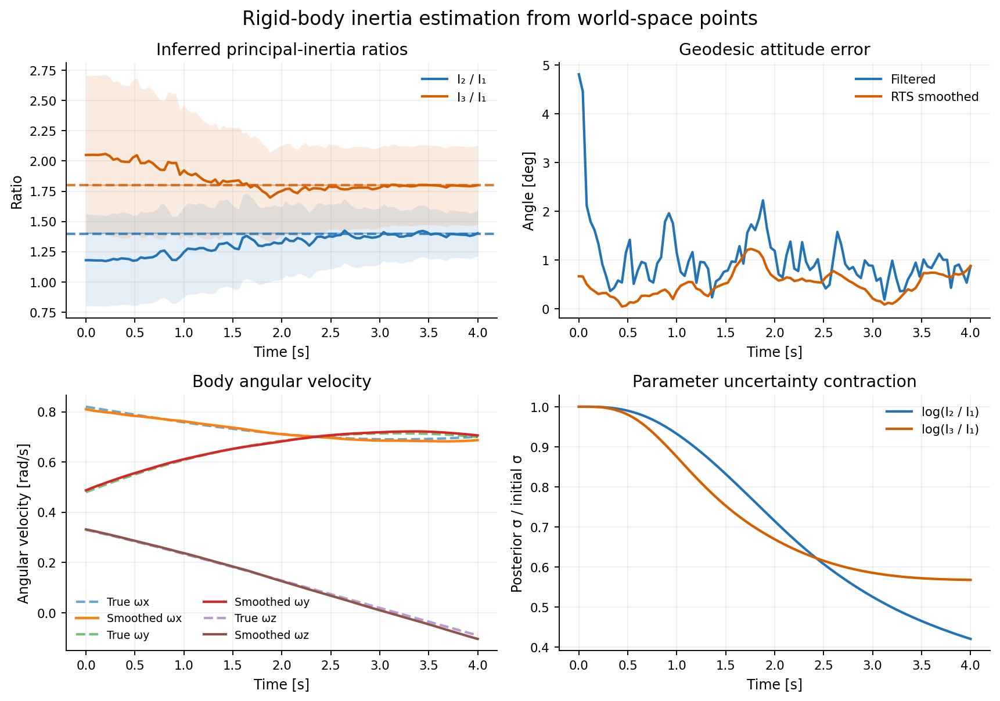

# BayesFilter

BayesFilter is a Python library for Bayesian filtering and smoothing. This library provides tools for implementing Bayesian filters, Rauch-Tung-Striebel smoothers, and other related methods. The only dependency is NumPy.



## Installation

Install the released package from PyPI:

```bash
python -m pip install bayesfilter
```

For local development, install the package with its test dependencies:

```bash
python -m pip install -e '.[test]'
```

## Constant-velocity example

The state below contains one-dimensional position and velocity. Observations
measure position only.

```python
import numpy as np

from bayesfilter.distributions import Gaussian
from bayesfilter.filtering import BayesianFilter
from bayesfilter.model import StateTransitionModel
from bayesfilter.observation import Observation
from bayesfilter.smoothing import RTS


def transition(state, delta_t_s):
    position, velocity = state
    return np.array([position + delta_t_s * velocity, velocity])


def transition_jacobian(_state, delta_t_s):
    return np.array([
        [1.0, delta_t_s],
        [0.0, 1.0],
    ])


def observe_position(state):
    return np.array([state[0]])


def observation_jacobian(_state):
    return np.array([[1.0, 0.0]])


transition_model = StateTransitionModel(
    transition_func=transition,
    transition_noise_covariance=np.diag([0.01, 0.001]),
    transition_jacobian_func=transition_jacobian,
)
initial_state = Gaussian(
    mean=np.array([0.0, 1.0]),
    covariance=np.diag([1.0, 0.25]),
)
bayes_filter = BayesianFilter(transition_model, initial_state)

rng = np.random.default_rng(0)
observation_times = np.arange(0.0, 10.5, 0.5)
position_measurements = observation_times + rng.normal(
    loc=0.0,
    scale=0.5,
    size=len(observation_times),
)
observations = [
    Observation(
        observation=np.array([position]),
        noise_covariance=np.array([[0.5**2]]),
        observation_func=observe_position,
        jacobian_func=observation_jacobian,
    )
    for position in position_measurements
]

filter_states, filter_times = bayes_filter.run(
    observations,
    observation_times,
    rate_hz=20.0,
    use_jacobian=True,
)

smoother_states = RTS(bayes_filter).apply(
    filter_states,
    filter_times,
    use_jacobian=True,
)
```

`BayesianFilter.run()` evaluates the model on its own fixed-rate time grid and
returns that grid as `filter_times`. Always pass `filter_times`, rather than the
original observation timestamps, to `RTS.apply()`. This matters whenever the
transition depends on `delta_t_s`.

As a convenience, filtering and smoothing can be run together:

```python
bayes_filter = BayesianFilter(transition_model, initial_state)
smoother_states = RTS(bayes_filter).smooth(
    observations,
    observation_times,
    rate_hz=20.0,
    use_jacobian=True,
)
```

Use the explicit `run()` followed by `apply()` form when the corresponding
filter timestamps are also needed.



*Noisy position measurements are filtered forward and then refined by the RTS
smoother; velocity is inferred without being observed directly.*

## Jacobian and unscented modes

Set `use_jacobian=True` on filtering and smoothing calls to use the supplied
transition and observation Jacobians. Both Jacobian functions are required in
this mode.

Set `use_jacobian=False` to use unscented propagation. Jacobian functions may
then be omitted:

```python
filter_states, filter_times = bayes_filter.run(
    observations,
    observation_times,
    rate_hz=20.0,
    use_jacobian=False,
)
```

For a Jacobian transition with covariance `P` and transition matrix `F`, the
predicted covariance and state-to-prediction cross-covariance are

```text
P_pred = F @ P @ F.T + Q
cross_cov = P @ F.T
```

The RTS smoother gain is therefore

```text
G = cross_cov @ inv(P_pred)
```

The unscented path obtains the corresponding cross-covariance directly from
the propagated sigma points.

## Synchronous observations

When there is exactly one observation per transition interval, use
`run_synchronous()`:

```python
states = bayes_filter.run_synchronous(
    observations,
    times_s,
    use_jacobian=True,
)
```

For `N` timestamps this method consumes at most `N - 1` observations and
returns the initial state followed by each updated state. Use `run()` for
irregularly timed observations or when several observations may fall within a
single filter interval.

## Covariance conventions

All noise arguments are covariance matrices, not standard deviations. For a
scalar measurement with standard deviation `sigma`, use
`np.array([[sigma**2]])`.

The transition noise covariance is added once per prediction performed by the
filter. Observation covariances are added during their corresponding updates.

## Examples

The examples generate deterministic synthetic observations, run a Bayesian
filter and RTS smoother, print quantitative errors, and save Matplotlib figures
under `examples/figures/`.

Install Matplotlib separately when running the examples:

```bash
python -m pip install -e .
python -m pip install -r examples/requirements.txt
```

Matplotlib is not a BayesFilter runtime dependency.

### Running the examples

| Model | State | Command |
| --- | --- | --- |
| Constant velocity, 1D | `[p, v]` | `python -m examples.constant_velocity_1d` |
| Constant velocity, 2D | `[pₓ, pᵧ, vₓ, vᵧ]` | `python -m examples.constant_velocity_2d` |
| Constant velocity, 3D | `[p, v]`, with three-vectors | `python -m examples.constant_velocity_3d` |
| Planar trajectory tracking | `[pₓ, pᵧ, vₓ, vᵧ]` | `python -m examples.planar_trajectory_tracking` |
| Constant acceleration, 1D | `[p, v, a]` | `python -m examples.constant_acceleration_1d` |
| Constant acceleration, 2D | `[p, v, a]`, with two-vectors | `python -m examples.constant_acceleration_2d` |
| Constant acceleration, 3D | `[p, v, a]`, with three-vectors | `python -m examples.constant_acceleration_3d` |
| Rigid body, known inertia | `[p, v, ϕ, ω]` | `python -m examples.rigid_body_known_inertia` |
| Rigid body, inferred inertia | `[p, v, ϕ, ω, η₂, η₃]` | `python -m examples.rigid_body_inertia_estimation` |

Regenerate every figure, including the figure at the top of this README, with:

```bash
python -m examples.generate_figures
```

All examples use fixed random seeds. Their simulation functions can be
imported without importing Matplotlib.

### Constant-velocity tracking

For spatial dimension `d`, the state contains position and velocity:

```text
x = [p, v]
```

The transition and position observation matrices are

```text
F = [[I, dt I],
     [0,    I]]

H = [I, 0]
```

Process noise uses the discrete white-acceleration covariance

```text
Q = q [[dt³/3, dt²/2],
       [dt²/2,    dt]] ⊗ I.
```

| 1D | 2D | 3D |
| --- | --- | --- |
|  |  |  |

The same position-and-velocity state can reconstruct a curved planar
trajectory. The ellipses below show selected 95% smoothed position-confidence
regions.



### Constant-acceleration tracking

The state contains position, velocity, and acceleration:

```text
x = [p, v, a]
```

Its transition is

```text
F = [[I, dt I, ½ dt² I],
     [0,    I,     dt I],
     [0,    0,        I]].
```

Process noise uses the corresponding discrete white-jerk covariance. As in
the velocity examples, noisy position is the only observed state component.

| 1D | 2D | 3D |
| --- | --- | --- |
|  |  |  |

The current transition-model API stores one fixed process covariance. These
examples therefore use fixed-cadence synchronous observations and construct
`Q` for that cadence.

### Rigid-body state and dynamics

The rigid-body state is

```text
x = [p, v, ϕ, ω],
```

where `p` and `v` are world-frame center position and velocity, `ω` is
body-frame angular velocity, and `ϕ ∈ R³` is a rotation bivector/vector. Its
equivalent representations are

```text
R = Exp([ϕ]×)
q = Exp(½ [0, ϕ])
ϕ = 2 vec(Log(q)).
```

Translation follows constant velocity. Rotation follows the torque-free Euler
equation for a body with inertia matrix `I`:

```text
I ω̇ + ω × (I ω) = 0.
```

Angular velocity is integrated with RK4. Attitude is advanced by composition
on SO(3):

```text
R_next = R Exp([dt ω_mid]×).
```

The state is then returned to bivector coordinates with `Log(R_next)`. The
examples remain inside one principal-log chart and do not cross the `π` branch
boundary. BayesFilter does not yet provide manifold-aware Gaussian means or
retractions, so this chart restriction is intentional.

### World-space point observations

The body carries four labeled canonical points:

```text
c₀ = 0,  c₁ = 0.75 e₁,  c₂ = 0.75 e₂,  c₃ = 0.75 e₃.
```

Their predicted world locations are

```text
hᵢ(x) = p + R(ϕ)cᵢ.
```

The origin marker observes translation directly. Subtracting it from the
other marker positions recovers scaled columns of the rotation matrix. The
filter residual therefore lives in ordinary Cartesian point space; it never
subtracts quaternions or rotation vectors directly.

#### Known fixed inertia

The known-inertia example uses `diag(1.0, 1.4, 1.8)` and the unscented filter
and smoother. Its figure shows position tracking, geodesic attitude error,
body angular velocity, and numerical conservation of torque-free invariants.



#### Inferring inertia ratios in the state

Torque-free angular motion is unchanged if every principal moment is scaled
by the same constant. Absolute inertia scale is therefore unobservable from
these measurements. The augmented example fixes `I₁ = 1` and estimates the
two identifiable log ratios

```text
η₂ = log(I₂ / I₁),  η₃ = log(I₃ / I₁).
```

Exponentiation keeps the inferred ratios positive. The parameters have tiny
process noise and are inferred indirectly from the observed world-space point
trajectories—there are no direct angular-velocity or inertia measurements.
The default run uses 100 point-observation sets over four seconds, making both
the ratio convergence and posterior-uncertainty contraction visible.



To identify absolute inertia scale, an example would need a known applied
torque or another measurement that supplies scale information.

## Tests

The suite contains analytic linear-Gaussian regression tests and integration
tests covering filtering, smoothing, irregular observation timing, batched
observations, and both propagation modes.

```bash
python -m pip install -e '.[test]'
python -m pytest
```

Pytest measures branch coverage for the `bayesfilter` package and enforces the
minimum configured in `pytest.ini`.

## Package layout

- `bayesfilter/distributions.py`: Gaussian distributions and sigma points.
- `bayesfilter/model.py`: State transition models.
- `bayesfilter/observation.py`: Observation models.
- `bayesfilter/filtering.py`: Bayesian prediction and update loops.
- `bayesfilter/smoothing.py`: RTS smoothing.
- `bayesfilter/unscented.py`: Unscented-transform utilities.
- `examples/`: Runnable tracking and rigid-body examples and their figures.
- `tests/`: Unit and integration tests.

## License

BayesFilter is distributed under the MIT License. See `licence.txt`.
