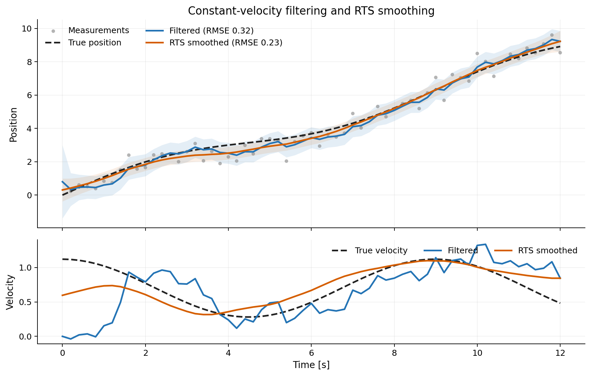
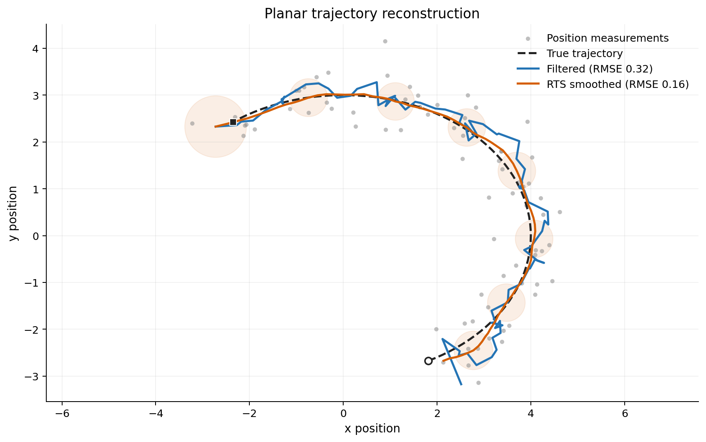

# BayesFilter

BayesFilter is a Python library for Bayesian filtering and smoothing. This library provides tools for implementing Bayesian filters, Rauch-Tung-Striebel smoothers, and other related methods. The only dependency is NumPy.



## Installation

Install the released package from PyPI:

```bash
python -m pip install bayesfilter
```

For local development, install the package with its test dependencies:

```bash
python -m pip install -e '.[test]'
```

## Constant-velocity example

The state below contains one-dimensional position and velocity. Observations
measure position only.

```python
import numpy as np

from bayesfilter.distributions import Gaussian
from bayesfilter.filtering import BayesianFilter
from bayesfilter.model import StateTransitionModel
from bayesfilter.observation import Observation
from bayesfilter.smoothing import RTS


def transition(state, delta_t_s):
    position, velocity = state
    return np.array([position + delta_t_s * velocity, velocity])


def transition_jacobian(_state, delta_t_s):
    return np.array([
        [1.0, delta_t_s],
        [0.0, 1.0],
    ])


def observe_position(state):
    return np.array([state[0]])


def observation_jacobian(_state):
    return np.array([[1.0, 0.0]])


transition_model = StateTransitionModel(
    transition_func=transition,
    transition_noise_covariance=np.diag([0.01, 0.001]),
    transition_jacobian_func=transition_jacobian,
)
initial_state = Gaussian(
    mean=np.array([0.0, 1.0]),
    covariance=np.diag([1.0, 0.25]),
)
bayes_filter = BayesianFilter(transition_model, initial_state)

rng = np.random.default_rng(0)
observation_times = np.arange(0.0, 10.5, 0.5)
position_measurements = observation_times + rng.normal(
    loc=0.0,
    scale=0.5,
    size=len(observation_times),
)
observations = [
    Observation(
        observation=np.array([position]),
        noise_covariance=np.array([[0.5**2]]),
        observation_func=observe_position,
        jacobian_func=observation_jacobian,
    )
    for position in position_measurements
]

filter_states, filter_times = bayes_filter.run(
    observations,
    observation_times,
    rate_hz=20.0,
    use_jacobian=True,
)

smoother_states = RTS(bayes_filter).apply(
    filter_states,
    filter_times,
    use_jacobian=True,
)
```

`BayesianFilter.run()` evaluates the model on its own fixed-rate time grid and
returns that grid as `filter_times`. Always pass `filter_times`, rather than the
original observation timestamps, to `RTS.apply()`. This matters whenever the
transition depends on `delta_t_s`.

As a convenience, filtering and smoothing can be run together:

```python
bayes_filter = BayesianFilter(transition_model, initial_state)
smoother_states = RTS(bayes_filter).smooth(
    observations,
    observation_times,
    rate_hz=20.0,
    use_jacobian=True,
)
```

Use the explicit `run()` followed by `apply()` form when the corresponding
filter timestamps are also needed.



*Both figures are generated from deterministic BayesFilter runs by
`docs/generate_readme_figures.py`.*

## Jacobian and unscented modes

Set `use_jacobian=True` on filtering and smoothing calls to use the supplied
transition and observation Jacobians. Both Jacobian functions are required in
this mode.

Set `use_jacobian=False` to use unscented propagation. Jacobian functions may
then be omitted:

```python
filter_states, filter_times = bayes_filter.run(
    observations,
    observation_times,
    rate_hz=20.0,
    use_jacobian=False,
)
```

For a Jacobian transition with covariance `P` and transition matrix `F`, the
predicted covariance and state-to-prediction cross-covariance are

```text
P_pred = F @ P @ F.T + Q
cross_cov = P @ F.T
```

The RTS smoother gain is therefore

```text
G = cross_cov @ inv(P_pred)
```

The unscented path obtains the corresponding cross-covariance directly from
the propagated sigma points.

## Synchronous observations

When there is exactly one observation per transition interval, use
`run_synchronous()`:

```python
states = bayes_filter.run_synchronous(
    observations,
    times_s,
    use_jacobian=True,
)
```

For `N` timestamps this method consumes at most `N - 1` observations and
returns the initial state followed by each updated state. Use `run()` for
irregularly timed observations or when several observations may fall within a
single filter interval.

## Covariance conventions

All noise arguments are covariance matrices, not standard deviations. For a
scalar measurement with standard deviation `sigma`, use
`np.array([[sigma**2]])`.

The transition noise covariance is added once per prediction performed by the
filter. Observation covariances are added during their corresponding updates.

## Tests

The suite contains analytic linear-Gaussian regression tests and integration
tests covering filtering, smoothing, irregular observation timing, batched
observations, and both propagation modes.

```bash
python -m pip install -e '.[test]'
python -m pytest
```

Pytest measures branch coverage for the `bayesfilter` package and enforces the
minimum configured in `pytest.ini`.

## Package layout

- `bayesfilter/distributions.py`: Gaussian distributions and sigma points.
- `bayesfilter/model.py`: State transition models.
- `bayesfilter/observation.py`: Observation models.
- `bayesfilter/filtering.py`: Bayesian prediction and update loops.
- `bayesfilter/smoothing.py`: RTS smoothing.
- `bayesfilter/unscented.py`: Unscented-transform utilities.
- `tests/`: Unit and integration tests.

## License

BayesFilter is distributed under the MIT License. See `licence.txt`.
